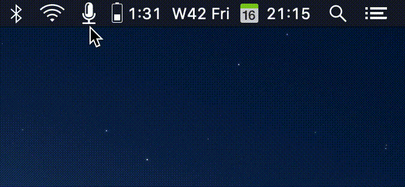

# OSX PushToTalk

OSX PushToTalk mutes and unmutes the microphone via a keypress.



Features:

- Hold a hotkey (default to **Right option**) to unmute and release to mute
- Configurable hotkey ([@jeremyellison](https://github.com/yulrizka/osx-push-to-talk/commits?author=jeremyellison))
- Configurable device ([@jeremyellison](https://github.com/yulrizka/osx-push-to-talk/commits?author=jeremyellison))
- Tested with Mojave & Catalina

The icon indicator will be red if the microphone *not* muted

## Installation

### HomeBrew

```
$ brew install yulrizka/tap/pushtotal
...
==> Caveats
The application was only built in "/usr/local/opt/pushtotalk/PushToTalk.app"

To make it available in the Application folder, create a symlink with:

    ln -s "/usr/local/opt/pushtotalk/PushToTalk.app" "/Applications/PushToTalk.app"
```

or 

```
$ brew tap yulrizka/tap # to update the tap repo
$ brew install pushtotalk
```

### Build from source
```
$ git clone git@github.com:yulrizka/osx-push-to-talk.git
$ cd osx-push-to-talk
$ xcodebuild -target "PushToTalk" -configuration Release
```

This requires you to have `Xcode` installed. Once The building process is finished, you will have the application in `build/Release/` folder.
Move the `PushToTalk.app` to `Applications` directory.

## Troubleshooting

### The app is from an unidentified developer

The main reason the app is not signed is due to the costly yearly subscription of the Apple developer program.
I do not obtain it my self since I am not mainly an Apple developer.

To enable an exception for this app, follow https://support.apple.com/kb/PH11436?locale=en_US

If you want to be sure, just compile the project, Archive & export PushToTalk.app

### Uninstall

Delete `PushToTalk.app` in `Applications` directory

## Acknowledgement

- Status Icon by [jeff](https://thenounproject.com/jeff955/) (CC)
- Keyboard Caps by [Arthur Shlain](https://thenounproject.com/ArtZ91/) (CC)
